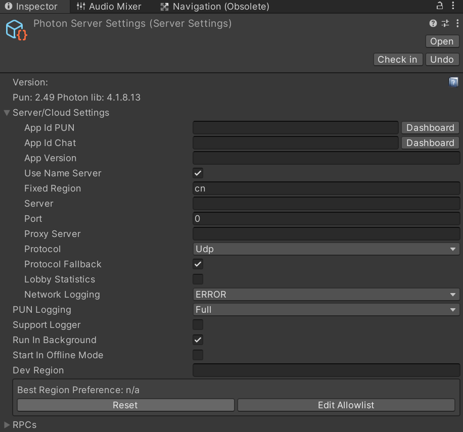
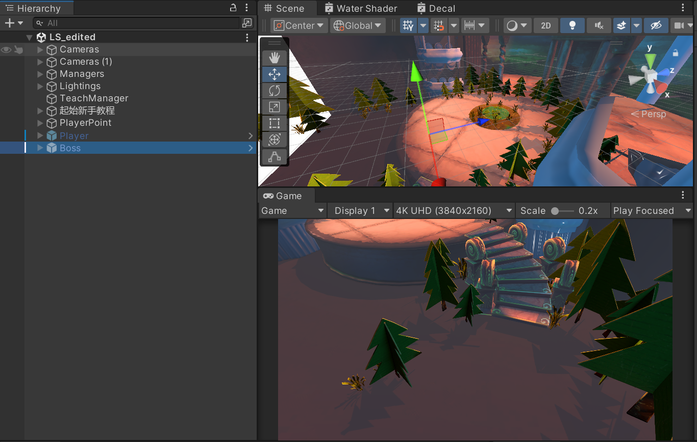

<h1 align="center">Last Stroke(open source version)
</h1>

 

 </img>
<i>

We are a team of students from Tongji University and Capital University of Economics and Business. In this project, we have carried out the design of the mechanism of simultaneous drawing by multiple people in the same time and space, point-clouding and segmentation and fusion of patterns. 
We've invested a lot of time in handwriting recognition to optimize the performance as well as the recognition effect, and we hope this project would give you some ideas about gesture recognition game development.  
The art models used in this project are not commercialized.</i>

### Prerequisites 
- Unity ver. 2022.3.17f1c1 or higher
### Code Structure:
 - Assets
    - Imports
    - Photon
    - Plugins
         - DOTWEEN
    - Resources
         - Animation
         - Models
         - RecognizeDataSet
    - Scenes
    - Scripts
         - Audio(removed)
         - Base
         - Boss(for red hat)
         - Player(for wolf)
         - Setting(removed)
         - System
         - Timeline(for player birth)
         - Tool
            - Camera
            - Erase(red hat skills)
            - GestureCredit
            - Recognize
            - Write
        - Settings(URP)
        - Shaders
            - Paint
            - PlantsShader

## Running the project

1. Apply for an appid on [Multiplayer Game Development Made Easy | Photon Engine](https://www.photonengine.com/) and fill it out in-game to ensure that networking features are properly allowed. Since the project code is deeply integrated with photon, we don't have the energy to remove it at the moment.

 

2. You can switch between characters in the scene view, just adjust the active state. 

 

We are sorry that due to the open source agreement and the copyright protection of the art development, we can't open source all the resources, so the open source version will be slightly different from the released version on [bilibili](https://www.bilibili.com/video/BV1a179zAExK/?share_source=copy_web&vd_source=4bfa678657048a7912dbdf1bb78d9ca4).But we have already open-sourced the core technology, so you will be able to understand it after a little research!
## Implementation Principle

![[Assets/ReadMeFiles/5.png]]

![[Assets/ReadMeFiles/6.png]]
## References
- [mixandjam/Splatoon-Ink: Recreating the Ink System from Splatoon](https://github.com/mixandjam/Splatoon-Ink) 
- [BrettHuang2019/DigitRecognition](https://github.com/BrettHuang2019/DigitRecognition)
- [DaVikingCode/PDollar-Unity: PDollar algorithm Unity friendly](https://github.com/DaVikingCode/PDollar-Unity)
## Contributors

<table>
  <tbody>
    <tr>
      <td align="center" valign="top" width="14.28%"><a href="https://github.com/Shoreee"> <b>Shoreeee</b></a> Director</td>
      <td align="center" valign="top" width="14.28%"><a href="https://github.com/Haskyyyyyyyy"> <b>Haskyyyyyyyy</b></a> Programmer</td>
      <td align="center" valign="top" width="14.28%"><a href="https://github.com/ziduzhe"> <b>ziduzhe</b></a> Programmer</td>
      <td align="center" valign="top" width="14.28%"><a href="https://github.com/ZJHHHH-123"> <b>ZJHHHH-123</b></a> Programmer</td>
    </tr>
    <tr>
      <td align="center" valign="top" width="14.28%"> <b>Panmas</b> Art Design</td>
      <td align="center" valign="top" width="14.28%"> <b>kuiyin</b> Art Design</td>
      <td align="center" valign="top" width="14.28%"> <b>Sisee</b> Art Design</td>
      <td align="center" valign="top" width="14.28%"><a href="https://youtube.com/@yonewaka1139?si=prv4aatJl04EMhxU"> <b>yonewaka米米若</b></a> Music& Sound Effects</td>
    </tr>
  </tbody>
  <tfoot>
    <tr>
      <td align="center" size="13px" colspan="7">
        
          <a href="https://all-contributors.js.org/docs/en/bot/usage">Add your contributions</a>
        </img>
      </td>
</table>

We still haven't figured out a game format that best fits this mechanic, so if you have questions, feel free to join and get in touch with our leader [Shoreee](https://github.com/Shoreee)!

Please follow the open source agreement in development. 
This project follows the [all-contributors](https://github.com/all-contributors/all-contributors) specification. Contributions of any kind welcome!

